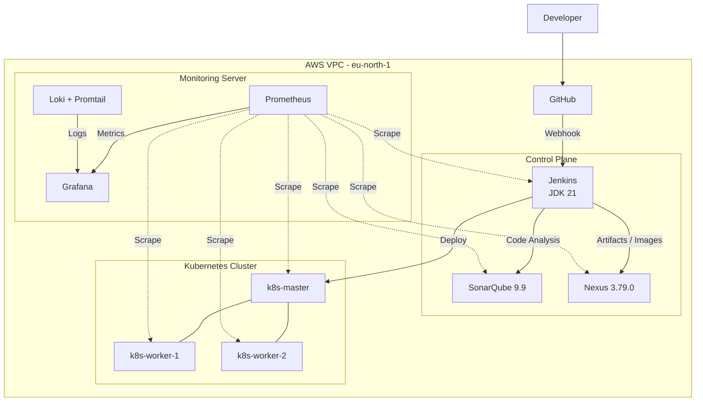

# 🚀 DevOps Platform — End-to-End Automation
A fully automated, secure, and observable DevOps platform built from a blank AWS account.Provisioned with Terraform, configured with Ansible, secured with RBAC, and observed with the Prometheus + Loki + Grafana stack.

## 📖 Table of Contents

<ol>
<li>Overview </li>
<li>Architecture> </li>
<li>Infrastructure Topology </li>
<li>Requirements </li>
<li>Repository Structure </li>
<li>Quick Start </li>
<li>Tool Documentation </li>
<li>Usage </li>
<li>Teardown </li>
<li>Roadmap </li>
<li>Contributing </li>
</ol>

## 🧭 Overview
This repository delivers a complete DevOps platform that takes an empty AWS account and transforms it into a production-ready, observable CI/CD environment.

**Key capabilities:**

⚙️ Infrastructure as Code with Terraform (zero-cost destroy/apply loop)     
🛠️ Configuration Management with Ansible (idempotent roles)         
🔐 Security & RBAC with JCasC and REST APIs (no hardcoded secrets)       
📈 Observability with Prometheus, Loki, Grafana     
🔁 CI/CD pipeline for a MERN application        
☸️ Kubernetes binaries pre-installed (bootstrap-ready)      

## 🏗 Architecture




## 🖥 Infrastructure Topology

Docker is compulsory on all servers

| # | Server Name | Role | Services Running | OS |
|---|---|---|---|---|
| 1 | `control-node` | CI/CD & Artifact Store | Jenkins, SonarQube, Promtail | Ubuntu 22.04 |
| 2 | `monitoring-node` | Observability | Nexus, Prometheus, Grafana, Loki, Promtail | Ubuntu 22.04 |
| 3 | `k8s-master` | Kubernetes Control Plane | K8s binaries (not-fully furnished) | Ubuntu 22.04 |
| 4 | `k8s-worker-1` | Kubernetes Worker | K8s binaries (not-fully furnished) | Ubuntu 22.04 |
| 5 | `k8s-worker-2` | Kubernetes Worker | K8s binaries (not-fully furnished) | Ubuntu 22.04 |

## ✅ Requirements

The platform depends on the following tools. Click any tool name to open its detailed setup guide.

### 🔧 Local Prerequisites (on your workstation)

## 🛠️ Prerequisites

| Tool | Purpose | Minimum Version | Documentation |
|---|---|---:|---|
| [**Terraform**]() | Infrastructure provisioning | ≥ 1.5.0 | [**Setup →**]() |
| [**Ansible**]() | Configuration management | ≥ 2.12 | [**Setup →**]() |
| [**AWS CLI**]() | Cloud authentication | ≥ 2.13 | [**Setup →**]() |
| [**Git**]() | Source control | ≥ 2.40 | [**Setup →**]() |
| [**SSH Client**]() | Instance access | Any | [**Setup →**]() |

### ☁️ Cloud Provider


### 📦 Platform Tooling (installed by Ansible on remote hosts)

| Tool | Version | Server | Purpose | Documentation |
|---|---|---|---|---|
| [**AWS Account**]() | — | All | Compute, networking & IAM | [**Setup →**]() |

## ⚙️ Infrastructure & Platform Tools

| Tool | Version | Server | Purpose | Documentation |
|---|---|---|---|---|
| [**Docker**](./docs/docs/docs-why/docker.md) | Latest | All | Container runtime | [**Setup →**]() |
| [**Jenkins**](./docs/docs/docs-why/jenkins.md) | LTS (JDK 21) | `control-node` | CI/CD server | [**Setup →**]() |
| [**SonarQube**](./docs/docs/docs-why/sonarqube.md) | 9.9 | `control-node` | Static code analysis | [**Setup →**]() |
| [**Nexus**](./docs/docs/docs-why/nexus.md) | 3.79.0 | `control-node` | Artifact & Docker registry | [**Setup →**]() |
| [**Prometheus**](./docs/docs/docs-why/prometheus.md) | Latest | `monitoring-node` | Metrics collection | [**Setup →**]() |
| [**Grafana**](./docs/docs/docs-why/grafana.md) | Latest | `monitoring-node` | Dashboards & visualization | [**Setup →**]() |
| [**Loki**](./docs/docs/docs-why/loki.md) | Latest | `monitoring-node` | Log aggregation | [**Setup →**]() |
| [**Promtail**](./docs/docs/docs-why/promtail.md) | Latest | `monitoring-node` | Log collection & shipping | [**Setup →**]() |
| [**Node Exporter**](./docs/docs/docs-why/node_exporter.md) | Latest | All | Host-level metrics | [**Setup →**]() |
| [**Kubernetes**]() | Latest | `k8s-*` | Container orchestration | [**Setup →**]() |


### Pre-requisites
- Vagrant
- Ansible
- Terraform
- Aws cli

### 🛠️ How to Setup the environment?

You can deploy this platform either locally using Vagrant or in the AWS Cloud using Terraform. Once the servers are provisioned, Ansible is used to install and configure all tools (Docker, Jenkins, Nexus, Monitoring, etc.) identically across both environments.

**🖥️ Local Environment (Vagrant)**
  
Ideal for local development and testing without incurring cloud costs.

Prerequisites: [Vagrant](./docs/docs/setup/vagrant-setup.md), [VirtualBox](https://www.virtualbox.org/wiki/Downloads), [Ansible](./docs/docs/setup/ansible-setup.md)


**☁️ AWS Cloud Environment (Terraform)**

Ideal for testing real cloud infrastructure. Supports a $0.00 destroy/apply loop.

Prerequisites: [AWS CLI](./docs/docs/setup/aws-cli-installation.md), [Terraform](./docs/docs/setup/terraform-setup.md), [Ansible](./docs/docs/setup/ansible-setup.md)

## 🚀 Quick Start

1. Clone the repository
```bash
git clone <repo>
cd devops-platform
```
2. Configure AWS credentials
```bash
aws configure
```
```output
# AWS Access Key ID: ********
# AWS Secret Access Key: ********
# Default region name: eu-north-1
# Default output format: json
```
3. Provision infrastructure

4. Configure servers
